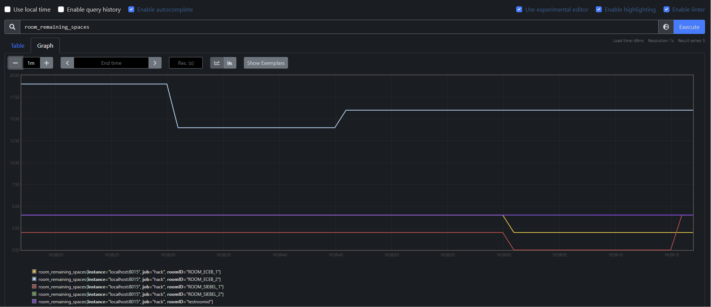

# HackIllinois API Systems Sub-Team Challenge Submission
> A room occupancy tracking system

## Introduction
With in-person hacks returning, a useful feature to add to HackIllinois' backend is the ability to track room occupancy across the various buildings in the event. 

This will serve multiple broad purposes:

- Allow participants to view room occupancy to easily locate empty rooms to work in
- Enable collection of anonymized data by staff for data analysis of human traffic (can be done either during or after the event). This can allow the staff to utilize the data to better plan out room allocations for subsequent events

Participants should scan QR codes placed outside rooms to check in to a room. Similarly, participants should scan the QR code when leaving the room to check out.

## Implementation
There is a total of 1 new microservice being implemented, consisting of 3 endpoints. The details of the endpoints are detailed in the HackIllinois documentation. 

As a quick overview, the three endpoints are
- A GET endpoint to retrieve the remaining capacity of a particular room
- A GET endpoint to retrieve the remaining capacity of all rooms
- A POST endpoint toe update the remaining capacity of a room

## Visualization Tool for Staff
This challenge submissions also includes logic to collect metrics to visualize room capacity, and how they change over time. The metric collection and aggregation is done by [Prometheus](https://prometheus.io/), an event monitoring an alerting tool.

*Figure 1: Sample Prometheus visualization running on my local machine*

In fact, this is part of my vision to enhance HackIllinois' backend observability. Besides common system level metrics like available memory, file descriptors, and process counts, custom metrics can be instrumented as well (eg. requests per second, HTTP errors per second). Integration with Slack for alerting can be set up as well to allow for production incidents to be troubleshooted and addressed as soon as possible. Furthermore, Prometheus can be integrated with [Grafana](https://grafana.com/), allowing for more powerful visualization and analytics.

## Future Work
- Integration with frontend (web/mobile). Possible implementations include UI elements to display available rooms, or a heatmap
- Recommendation system to recommend available rooms to participants, depending on their team size and location
